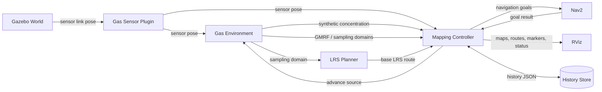
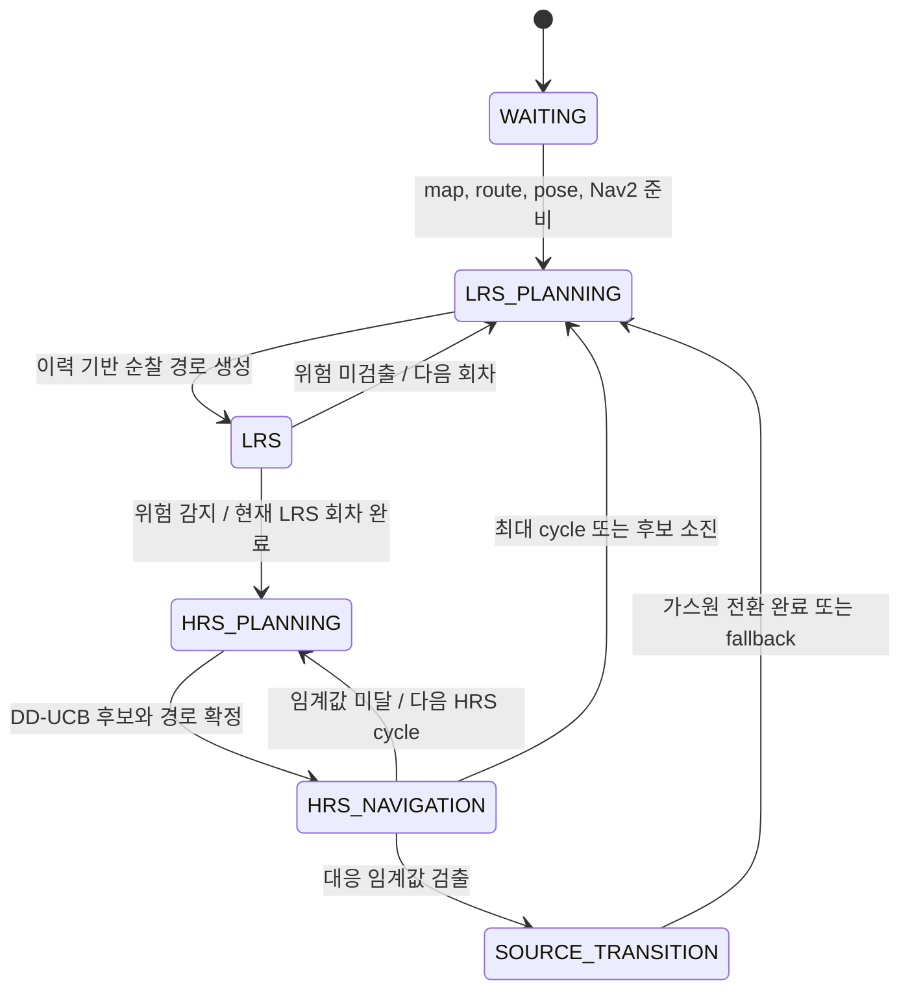

# ICIR Cleanroom: History-Aware Autonomous Gas Mapping

[](https://docs.ros.org/en/humble/)
[](https://releases.ubuntu.com/22.04/)
[](https://classic.gazebosim.org/)
[](https://www.python.org/)

ROS 2 이동 로봇이 저해상도 순찰(LRS), GMRF 기반 가스장 추정, DD-UCB 기반 고해상도 탐색(HRS)을 반복하며 위험 가스 발생 영역을 탐지하는 자율 가스 매핑 시뮬레이션입니다.

_A ROS 2 simulation for history-aware autonomous gas mapping with LRS patrol, GMRF estimation, and distance-discounted UCB exploration._

## 목차

- [프로젝트 개요](#프로젝트-개요)
- [Demo](#demo)
- [Quick Start](#quick-start)
- [시스템 구성](#시스템-구성)
- [실행 흐름](#실행-흐름)
- [핵심 알고리즘](#핵심-알고리즘)
- [지원 환경](#지원-환경)
- [가스원 발생 모드](#가스원-발생-모드)
- [요구 환경](#요구-환경)
- [설치 및 실행](#설치-및-실행)
- [운영 기능](#운영-기능)
- [설정](#설정)
- [프로젝트 구조](#프로젝트-구조)
- [테스트](#테스트)
- [제한사항 및 향후 과제](#제한사항-및-향후-과제)
- [Maintainer](#maintainer)

## 프로젝트 개요

ICIR Cleanroom은 넓은 공간을 효율적으로 순찰하면서 위험 신호가 확인된 영역을 집중 탐색하기 위한 ROS 2 기반 연구용 시뮬레이션입니다. TurtleBot3 모델이 Gazebo 환경을 이동하며 가스 농도를 측정하고, Mapping Controller가 측정값과 과거 검출 이력을 결합해 다음 행동을 결정합니다.

주요 특징은 다음과 같습니다.

- **LRS/HRS 계층형 탐색:** 넓은 영역을 순찰하는 LRS와 위험 영역을 정밀 탐색하는 HRS를 자동 전환합니다.
- **GMRF 가스장 추정:** 희소 측정으로부터 각 격자 셀의 예상 농도와 불확실성을 함께 추정합니다.
- **DD-UCB 후보 선택:** 예상 농도, 불확실성, 로봇과의 거리를 함께 고려해 HRS 후보를 선정합니다.
- **이력 기반 순찰 개선:** 과거의 재발 위치, 심각도, 경과시간, 불확실성을 반영해 다음 LRS 경로를 조정합니다.
- **재현 가능한 환경 프로필:** 빈 50 m 환경과 AWS Small Warehouse 환경을 동일한 launch 인터페이스로 실행할 수 있습니다.


## Demo
[](https://www.youtube.com/watch?v=_rfHPxJ0KWs)

데모 영상에서는 다음 과정을 확인할 수 있습니다.

1. LRS 순찰 경로 생성과 Nav2 기반 이동
2. 센서 측정에 따른 GMRF 평균·분산 지도 갱신
3. 위험 농도 감지 후 HRS 전환
4. DD-UCB 후보 선정과 정밀 탐색
5. 대응 임계값 확인, 이력 저장, 가스원 전환

## Quick Start

ROS 2 Humble이 설치된 Ubuntu 22.04 환경을 기준으로 합니다.

```bash
mkdir -p ~/icir_ws/src
cd ~/icir_ws/src
git clone https://github.com/iCIRLab/icir_cleanroom.git

cd ~/icir_ws
source /opt/ros/humble/setup.bash
sudo apt update
sudo apt install ros-humble-turtlebot3-description
# rosdep을 처음 사용하는 시스템에서는 먼저 `sudo rosdep init`을 실행합니다.
rosdep update
rosdep install --from-paths src --ignore-src -r -y
python3 -m pip install -r src/icir_cleanroom/requirements.txt

colcon build --packages-select icir_cleanroom --symlink-install
source install/setup.bash
ros2 launch icir_cleanroom aws_small_warehouse.launch.py
```

Gazebo, TurtleBot3, Nav2, 가스 환경 노드, 경로 계획기, Mapping Controller, RViz가 함께 시작됩니다. 초기화가 완료되면 로봇이 첫 번째 LRS 순찰을 자동으로 시작합니다.

## 시스템 구성



| 구성 요소 | 역할 |
| --- | --- |
| Gazebo | 로봇, 센서, 장애물, 시뮬레이션 시간을 제공합니다. |
| TurtleBot3 + Gas Sensor Plugin | Gazebo의 센서 link pose를 ROS 토픽으로 전달합니다. |
| Gas Environment | 센서 위치의 합성 농도, 가스원, ground truth와 GMRF·sampling·navigation goal domain을 발행합니다. |
| LRS Planner | 접근 가능한 영역을 K-means로 분할하고 대표 순찰 지점을 연결합니다. |
| Mapping Controller | LRS/HRS 상태, 측정, GMRF, 이력, 경로 계획과 가스원 전환을 총괄합니다. |
| Nav2 | 계획된 LRS/HRS 목표까지 로봇을 이동시키고 이동 결과를 반환합니다. |
| RViz | 추정 지도, 불확실성, DD-UCB, 경로, 측정값과 검출 이력을 시각화합니다. |

## 실행 흐름



1. 시스템은 지도, LRS 기본 경로, 센서 pose, sampling domain, navigation goal domain과 Nav2 action server를 기다립니다.
2. LRS 경로를 계산한 뒤 각 대표 지점으로 이동해 `lrs_dwell_seconds` 동안 농도를 측정합니다.
3. 측정값으로 GMRF를 갱신하고 히스토리를 기록합니다.
4. 측정값이 `hazard_threshold` 이상이면 위험 상태를 유지하되, **현재 LRS 순찰과 복귀를 완료한 후** HRS로 전환합니다.
5. HRS는 DD-UCB 점수가 높은 미측정 셀을 선택해 정밀 측정합니다.
6. 측정값이 `hrs_response_threshold` 이상이면 검출 이벤트를 확정하고 히스토리를 저장한 뒤 가스원 전환을 요청합니다.
7. 임계값에 도달하지 못하면 후보가 남아 있고 최대 cycle 이내인 동안 HRS를 반복하고, 그렇지 않으면 LRS로 복귀합니다.

## 핵심 알고리즘

### LRS: 넓은 영역 순찰

LRS(Low-Resolution Search)는 접근 가능한 sampling domain을 K-means로 분할하고 각 클러스터의 안전한 대표 지점을 선택합니다. 기본 대표 지점은 TSP 기반 폐곡선 경로로 연결됩니다.

저장된 검출 이력이 있으면 첫 회차부터, 이력이 없다면 데이터가 누적된 이후 회차부터 기본 경로를 조정합니다. 각 지점의 보상은 다음 요소의 가중합으로 구성됩니다.

- **Recurrence:** 과거 확정 검출 이벤트가 주변에서 반복된 정도
- **Severity:** 과거 측정 농도의 심각도
- **Staleness:** 해당 영역을 마지막으로 확인한 뒤 경과한 시간
- **Uncertainty:** 최근 이력 분포의 불확실성

우선 지점은 기본 경로 길이의 `lrs_route_length_ratio` 이내에서 포함되도록 계산됩니다. 가장 최근의 확정 검출 셀은 가능한 경우 필수 지점으로 유지됩니다.

### GMRF: 농도와 불확실성 추정

GMRF(Gaussian Markov Random Field)는 가스장 격자의 유효 셀을 8-neighbor 그래프로 구성합니다. 각 측정값은 가장 가까운 GMRF 셀의 최신 observation을 교체하며, 이웃 간 smoothness prior와 함께 평균 `μ`와 분산 `σ²`을 추정합니다.

실시간 갱신에는 GaBP(Gaussian Belief Propagation)를 사용합니다. 수렴 실패 시 더 낮은 damping으로 재시도하고, 배치 경계에서는 CG(Conjugate Gradient) 기준 해와의 최대 평균 오차를 검사합니다.

### DD-UCB: 거리 인식 HRS 후보 선택

각 미측정 후보 셀 `i`에 대해 먼저 정규화된 UCB를 계산합니다.

```text
UCBᵢ = clip(μᵢ + k√σᵢ², 0, 1)
```

- `μᵢ`: GMRF가 추정한 평균 농도
- `σᵢ²`: GMRF가 추정한 분산
- `k`: 탐색 강도를 조절하는 `hrs_ucb_k`

이후 현재 로봇 위치에서 후보까지의 거리 `dᵢ`로 점수를 감쇠합니다.

```text
DD-UCBᵢ = UCBᵢ / (1 + λdᵢ)
```

- 평균 농도가 높은 셀은 **exploitation** 관점에서 높은 점수를 얻습니다.
- 분산이 큰 셀은 **exploration** 관점에서 높은 점수를 얻습니다.
- 멀리 있는 셀은 `hrs_distance_weight`인 `λ`에 비례해 감점됩니다.

이미 측정한 셀, navigation goal domain 밖의 셀, 반복적으로 이동에 실패해 도달 불가로 판정된 셀은 후보에서 제외됩니다. 남은 셀을 DD-UCB 내림차순으로 정렬해 상위 `hrs_candidate_count`개를 선택하고, `hrs_update_seconds` 시간 예산 안에서 최대 `hrs_visit_count`개를 방문하는 exact open path를 계산합니다.

기본 `reward_ordered_exact` 모드는 보상 순으로 조합을 검사하고 Held-Karp로 정확한 경로를 구합니다. `paper_exhaustive_milp` 모드는 후보 조합마다 CBC 기반 MILP를 풀어 논문식 exhaustive 절차를 재현합니다.

<!-- TODO: docs/assets/dd-ucb-visualization.png 업로드 후 DD-UCB 지도 및 후보 이미지 추가 -->

## 지원 환경

| 환경 | Launch 파일 | 공간·해상도 | 기본 가스원 모드 | LRS 클러스터 |
| --- | --- | --- | --- | ---: |
| Empty 50 m | `empty_50m.launch.py` | 50 m × 50 m, GMRF 1.0 m | `recurrent_hotspots_after_peak` | 36 |
| AWS Small Warehouse | `aws_small_warehouse.launch.py` | 약 14 m × 20 m, GMRF 0.5 m | `random_after_peak` | 10 |

환경별 world, map, 로봇 초기 pose, 가스장 범위, navigation profile과 LRS 설정은 `config/environments/*.yaml`에서 관리합니다.

<!-- TODO: docs/assets/environments-comparison.png 업로드 후 환경 비교 이미지 추가 -->

## 가스원 발생 모드

| 모드 | 동작 | 확정 검출 이후 |
| --- | --- | --- |
| `manual` | `source_x`, `source_y`, strength와 sigma를 직접 사용합니다. 저장된 상태가 있으면 시작 시 복원합니다. | 가스원을 변경하지 않고 같은 이벤트로 LRS를 재개합니다. |
| `random_after_peak` | sampling 지점에서 설정 농도 이상 검출 가능한 임의의 grid 위치와 sigma를 생성합니다. | 이전 위치와 최소 분리 조건을 만족하는 새 가스원을 생성합니다. |
| `recurrent_hotspots_after_peak` | 가중치로 hotspot을 선택하고 주변에 Gaussian jitter를 적용해 재발 패턴을 생성합니다. | 새 hotspot 기반 가스원을 생성합니다. |

`*_after_peak`라는 모드 이름은 유지되는 공개 인터페이스입니다. 실제 전환 조건은 추정 peak가 아니라 HRS 측정값의 `hrs_response_threshold` 이상 여부입니다.

자동 모드는 최대 1,000회 동안 다음 조건을 만족하는 가스원을 생성합니다.

- GMRF grid에 정렬되고 환경 경계 안에 있을 것
- 설정한 sigma 범위를 만족할 것
- LRS 대표 지점 중 하나 이상에서 `source_random_detection_threshold` 이상의 농도를 만들 것
- `random_after_peak`에서는 이전 위치와 `source_random_min_separation` 이상 떨어질 것

| 핵심 파라미터 | 설명 |
| --- | --- |
| `source_enabled` | 가스원 활성화 여부 |
| `source_x`, `source_y` | 가스원 중심의 world 좌표 |
| `source_strength` | 중심 농도 계수, 자동 모드에서는 `1.0` |
| `source_sigma` | Gaussian 분포의 공간 확산 정도 |
| `source_random_seed` | 음수이면 비결정적, 0 이상이면 재현 가능한 난수 생성 |
| `persist_source_state` | 현재 가스원 상태를 JSON 파일로 저장할지 여부 |

자동 모드도 현재 상태를 JSON으로 저장하지만 시작 시 해당 파일을 복원하지 않고 새 가스원을 생성합니다. `manual` 모드에서만 저장된 가스원 상태를 시작 시 복원합니다.

## 요구 환경

| 항목 | 기준 |
| --- | --- |
| 운영체제 | Ubuntu 22.04 LTS |
| ROS | ROS 2 Humble |
| Simulator | Gazebo Classic 11, `gazebo_ros` |
| Navigation | Nav2 |
| Visualization | RViz2 |
| Robot assets | `turtlebot3_description` |
| Build | colcon, rosdep, CMake 3.8 이상 |
| Python | Python 3.10, NumPy, SciPy, PyYAML |
| Optimization | Python-MIP 1.17 이상, 2.0 미만 |

프로젝트는 ROS 2 Humble과 Ubuntu 22.04 조합을 기준으로 개발되었습니다. 다른 ROS 배포판, Gazebo Sim 또는 실제 로봇 환경에서의 호환성은 현재 보장하지 않습니다.

## 설치 및 실행

### 1. 저장소와 의존성 준비

`rosdep`을 처음 사용하는 시스템이라면 한 번만 초기화합니다. 이미 초기화했다면 이 단계는 건너뜁니다.

```bash
sudo rosdep init
rosdep update
```

```bash
mkdir -p ~/icir_ws/src
cd ~/icir_ws/src
git clone https://github.com/iCIRLab/icir_cleanroom.git

cd ~/icir_ws
source /opt/ros/humble/setup.bash
sudo apt update
sudo apt install ros-humble-turtlebot3-description
rosdep install --from-paths src --ignore-src -r -y
python3 -m pip install -r src/icir_cleanroom/requirements.txt
```

### 2. 빌드

```bash
cd ~/icir_ws
source /opt/ros/humble/setup.bash
colcon build --packages-select icir_cleanroom --symlink-install
source install/setup.bash
```

새 터미널을 열 때마다 ROS와 workspace 환경을 다시 source해야 합니다.

```bash
source /opt/ros/humble/setup.bash
source ~/icir_ws/install/setup.bash
```

### 3. 환경별 실행

빈 50 m 환경:

```bash
ros2 launch icir_cleanroom empty_50m.launch.py
```

AWS Small Warehouse:

```bash
ros2 launch icir_cleanroom aws_small_warehouse.launch.py
```

`use_sim_time`의 기본값은 `true`입니다. `cleanroom_empty.launch.py`는 기존 사용자를 위해 유지하는 `empty_50m` 호환 진입점입니다.

실행은 터미널에서 `Ctrl+C`로 종료합니다. 히스토리는 다음 실행 시 자동으로 복원됩니다. 가스원 상태는 [가스원 발생 모드](#가스원-발생-모드)에 설명된 모드별 정책을 따릅니다.

## 운영 기능

### 실행 중 히스토리맵 초기화

Mapping Controller가 실행 중일 때는 서비스를 사용하는 것이 안전합니다.

```bash
ros2 service call /gas_mapping/history/clear std_srvs/srv/Trigger "{}"
```

메모리와 `~/.ros/icir_cleanroom/gas_history.json`이 빈 이력으로 갱신됩니다. 현재 LRS 경로는 즉시 중단되지 않으며 다음 회차에서 빈 이력을 기준으로 다시 계산됩니다.

### 종료 후 저장 파일 초기화

| 파일 | 저장 내용 | 삭제 후 동작 |
|---|---|---|
| `gas_history.json` | 가스 측정값과 확정 검출 이력 | 다음 실행이 빈 히스토리맵으로 시작 |
| `gas_source_state.json` | `empty_50m`의 가스원 활성 여부, 위치, 세기, 확산도 | `manual` 모드는 YAML 기본값을 사용하고, 자동 모드는 새 가스원을 생성 |
| `aws_small_warehouse_gas_source_state.json` | `aws_small_warehouse`의 가스원 활성 여부, 위치, 세기, 확산도 | `manual` 모드는 YAML 기본값을 사용하고, 자동 모드는 새 가스원을 생성 |

먼저 시뮬레이션을 종료한 뒤 초기화하려는 파일만 삭제합니다.

```bash
# 측정 및 확정 검출 이력
rm -f ~/.ros/icir_cleanroom/gas_history.json

# empty_50m 가스원 상태
rm -f ~/.ros/icir_cleanroom/gas_source_state.json

# aws_small_warehouse 가스원 상태
rm -f ~/.ros/icir_cleanroom/aws_small_warehouse_gas_source_state.json
```

삭제한 파일은 필요한 상태가 저장될 때 자동으로 다시 생성됩니다. 가스원 상태 파일에는 `source_enabled`, `source_x`, `source_y`, `source_strength`, `source_sigma`가 저장됩니다. 자동 모드는 시작할 때 기존 가스원 상태를 복원하지 않으므로 파일을 삭제하지 않아도 매 실행마다 새 가스원을 생성합니다.

### 자동 가스원 즉시 전환

자동 가스원 모드에서는 확정 검출을 기다리지 않고 다음 가스원으로 전환할 수 있습니다.

```bash
ros2 service call /gas_mapping/source/advance std_srvs/srv/Trigger "{}"
```

`manual` 모드에서는 서비스가 성공 응답을 반환하지만 가스원은 변경되지 않습니다.

### Manual 모드에서 가스원 변경

환경 프로필의 `source_mode`를 `manual`로 설정하고 재빌드·재실행한 뒤 다음과 같이 변경할 수 있습니다.

```bash
ros2 param set /gas_environment_node source_x 10.0
ros2 param set /gas_environment_node source_y 10.0
ros2 param set /gas_environment_node source_strength 1.0
ros2 param set /gas_environment_node source_sigma 5.0
ros2 param set /gas_environment_node source_enabled true
```

좌표는 해당 환경의 map 범위 안에 있어야 하며 strength는 음수가 아니어야 하고 sigma는 양수여야 합니다. 자동 모드의 생성 정책 파라미터는 시작 시에만 적용되므로 변경 후 노드를 다시 시작해야 합니다.

## 설정

| 위치 | 책임 | 적용 방법 |
| --- | --- | --- |
| `config/environments/*.yaml` | world, map, spawn, 가스원, 격자, LRS 환경값 | 패키지 재빌드 후 재실행 |
| `config/navigation/*.yaml` | 환경별 속도, 가속도, costmap override | 패키지 재빌드 후 재실행 |
| `config/nav2_params.yaml` | 공통 Nav2 기본 설정 | 패키지 재빌드 후 재실행 |
| `config/mapping/default.yaml` | GMRF, LRS/HRS, 이력, dwell과 임계값 | 패키지 재빌드 후 재실행 |

`--symlink-install`로 빌드하면 Python 소스는 바로 반영되지만 `share`에 설치되는 YAML과 launch 파일은 변경 후 다시 빌드하는 것을 권장합니다.

주요 Mapping Controller 기본값은 다음과 같습니다.

| 파라미터 | 기본값 | 의미 |
| --- | ---: | --- |
| `hazard_threshold` | `0.15` | LRS에서 HRS 전환을 예약하는 위험 농도 |
| `hrs_response_threshold` | `0.50` | HRS 확정 검출 및 가스원 전환 기준 |
| `hrs_ucb_k` | `0.20` | UCB의 불확실성 탐색 강도 |
| `hrs_distance_weight` | `0.03` | 후보 거리 감쇠 계수 |
| `hrs_candidate_count` | `1` | DD-UCB 상위 후보 수 |
| `hrs_visit_count` | `1` | 한 HRS cycle에서 방문할 최대 후보 수 |
| `hrs_max_cycles_per_alert` | `10` | 한 위험 이벤트에서 반복할 최대 HRS cycle 수 |
| `hrs_update_seconds` | `50.0` | HRS 이동 및 측정 시간 예산 |
| `hrs_planner_mode` | `reward_ordered_exact` | HRS exact planner 선택 |

## 프로젝트 구조

```text
icir_cleanroom/
├── launch/                         # 공통 launch와 환경별 진입점
├── config/
│   ├── environments/               # world/map/gas/LRS 환경 프로필
│   ├── navigation/                 # 환경별 Nav2 및 로봇 motion override
│   ├── mapping/default.yaml        # GMRF, LRS/HRS, history 설정
│   └── nav2_params.yaml            # 공통 Nav2 설정
├── icir_cleanroom/gas_mapping/
│   ├── application/                # ROS 비의존 workflow와 runtime state
│   ├── mapping/                    # GMRF, domain, projection, K-means
│   ├── planning/                   # LRS/HRS 및 DD-UCB 경로 정책
│   ├── history/                    # 측정·확정 검출 이력과 JSON 저장소
│   ├── ros/                        # ROS node, Nav2, publisher, workflow adapter
│   ├── config.py                   # typed controller configuration
│   ├── environment.py              # 가스원 생성·검증·저장 로직
│   ├── models.py                   # 공통 상태와 데이터 모델
│   └── phase_machine.py            # LRS/HRS phase 전환 규칙
├── scripts/                        # ros2 run용 얇은 Python entrypoint
├── src/                            # Gazebo gas sensor C++ plugin
├── include/                        # C++ plugin header
├── worlds/                         # Gazebo world
├── maps/                           # Nav2 map
├── models/                         # AWS warehouse Gazebo assets
├── urdf/                           # TurtleBot3 + gas sensor 모델
├── rviz/                           # RViz 표시 설정
├── test/                           # 알고리즘·설정·ROS contract 회귀 테스트
├── CMakeLists.txt
├── package.xml
└── requirements.txt
```

`mapping`, `planning`, `history`, `application`의 핵심 계산 로직은 ROS node를 직접 import하지 않습니다. ROS 메시지와 middleware 연결은 `ros/` 어댑터에 집중되어 있어 알고리즘 단위 테스트와 재사용이 가능합니다.

## 테스트

```bash
cd ~/icir_ws
source /opt/ros/humble/setup.bash
source install/setup.bash
colcon test --packages-select icir_cleanroom
colcon test-result --verbose
```

테스트는 다음 동작을 검증합니다.

- GMRF GaBP/CG 결과, 수렴 재시도와 rollback
- DD-UCB 점수와 HRS 임계값 판정
- LRS/HRS exact 경로와 시간 예산
- K-means 대표 지점 및 접근 가능한 domain 구성
- history/source JSON 저장, 복원, 이전 버전 호환성
- 환경·navigation 프로필 유효성
- phase 및 비동기 planning generation
- RViz point/color 대응과 ROS 인터페이스 contract

## 제한사항 및 향후 과제

- 현재 가스장은 정적 2차원 Gaussian 농도 모델이며 실제 유체 확산, 풍향, 난류를 직접 모델링하지 않습니다.
- Gazebo Classic과 ROS 2 Humble 환경을 기준으로 하며 Gazebo Sim 및 다른 ROS 배포판은 별도 검증이 필요합니다.
- 실제 가스 센서와 실물 로봇을 이용한 배포 절차는 포함하지 않습니다.
- 환경 경계와 가스장 해상도는 환경 프로필에 명시적으로 정의해야 합니다.
- 향후 실제 센서 연동, 동적 확산 모델, 다중 로봇 탐색, 정량 벤치마크를 확장할 수 있습니다.

## Maintainer

- Maintainer: `changgyukim`
- Contact: [okpo2581@gmail.com](mailto:okpo2581@gmail.com)
- Repository: [github.com/iCIRLab/icir_cleanroom](https://github.com/iCIRLab/icir_cleanroom)

