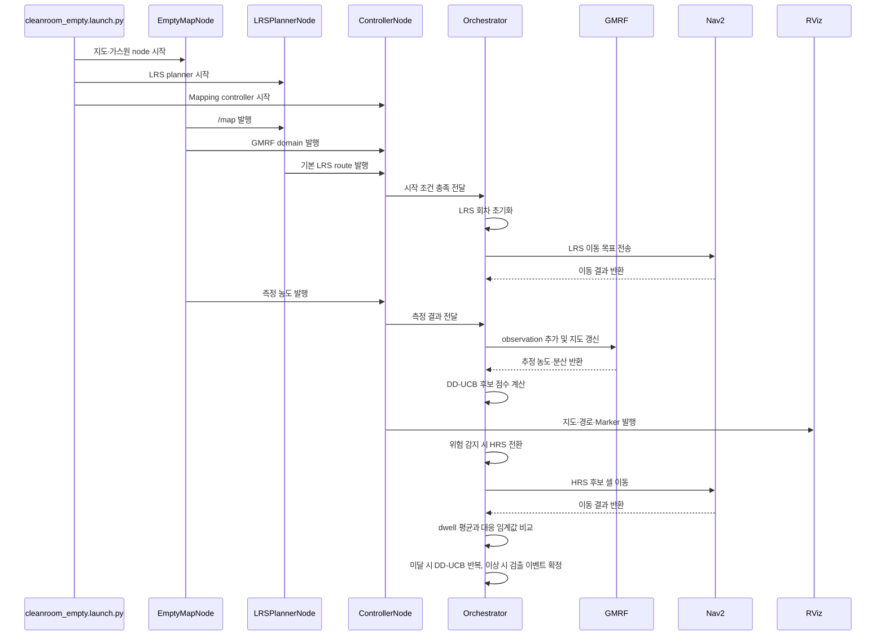

# icir_cleanroom

`cleanroom_empty` 가스 매핑 시뮬레이션을 실행하는 ROS 2 Humble 패키지입니다.

## 빌드

```bash
cd /home/gyu/icir_ws
source /opt/ros/humble/setup.bash
colcon build --packages-select icir_cleanroom --symlink-install
source install/setup.bash
```

## 실행

```bash
ros2 launch icir_cleanroom cleanroom_empty.launch.py
```

이 launch는 Gazebo와 TurtleBot3, Nav2, 가스 지도 생성기, LRS 경로 계획기,
LRS/HRS 매핑 컨트롤러 및 RViz를 시작합니다.

## 히스토리맵 초기화

실행 중인 시뮬레이션을 종료한 뒤 저장된 히스토리맵을 삭제합니다.

```bash
rm -f ~/.ros/icir_cleanroom/gas_history.json
```

다음 실행은 빈 히스토리맵으로 시작합니다.

## 전체 프로젝트 구조

세 `scripts/*.py` 파일은 기존 `ros2 run` 실행 이름을 보존하는 얇은
entrypoint입니다. 실제 구현은 `icir_cleanroom/gas_mapping` Python package에
역할별로 분리되어 있습니다.

```text
icir_cleanroom/
├── launch/
│   └── cleanroom_empty.launch.py       # 전체 시뮬레이션 시작점
├── scripts/                            # ros2 run 실행 진입점
│   ├── gas_empty_map_node.py           # → ros/empty_map_node.py
│   ├── gas_mapping_controller_node.py  # → ros/controller_node.py
│   └── lrs_path_planner_node.py        # → ros/lrs_planner_node.py
├── icir_cleanroom/gas_mapping/
│   ├── config.py                       # typed ROS configuration
│   ├── models.py                       # 공통 상태와 데이터 모델
│   ├── phase_machine.py                # LRS/HRS phase 전환 규칙
│   ├── environment.py                  # 가스원 생성·검증·저장
│   ├── ros/                            # ROS 통신과 메시지 변환
│   │   ├── controller_node.py          # 메인 mapping controller
│   │   ├── empty_map_node.py           # 지도와 가스 농도 발행
│   │   ├── lrs_planner_node.py         # 기본 LRS route 발행
│   │   ├── nav2_client.py              # Nav2 action 통신
│   │   ├── publishers.py               # 지도·경로·Marker 시각화
│   │   └── *_workflow.py               # Navigation/LRS/HRS 흐름 연결
│   ├── application/                    # 작업 흐름과 runtime state 관리
│   │   ├── orchestrator.py             # 전체 LRS/HRS 흐름 조정
│   │   ├── navigation.py               # 이동 상태와 재시도
│   │   ├── measurement.py              # dwell 측정
│   │   ├── planning_executor.py        # 비동기 planning 작업
│   │   ├── lrs.py                      # LRS 회차 상태
│   │   ├── hrs.py                      # HRS 후보·실패·종료 상태
│   ├── mapping/
│   │   ├── gmrf.py                     # GMRF, GaBP, CG
│   │   ├── gmrf_service.py             # 계산 재시도와 rollback
│   │   └── field_projection.py         # 표시용 grid 변환
│   ├── planning/
│   │   ├── exact_path.py               # 공통 Held-Karp 알고리즘
│   │   ├── lrs_tsp.py                  # 기본 LRS 순회 경로
│   │   ├── lrs_priority.py             # History 기반 LRS 우선 경로
│   │   ├── hrs.py                      # HRS 경로 최적화
│   │   └── hrs_policy.py               # UCB와 거리 감점 정책
│   └── history/
│       ├── model.py                     # 측정 이력·지역·보상 계산
│       └── repository.py                # History JSON 저장·복원
├── test/                               # 자동 회귀 테스트
├── src/gas_sensor_plugin.cpp           # Gazebo 가스 센서 plugin
├── include/icir_cleanroom/             # C++ plugin header
├── config/nav2_params.yaml             # Nav2 설정
├── worlds/empty_lrs_50m.world          # Gazebo 환경
├── urdf/                               # TurtleBot3 모델
├── rviz/cleanroom_empty.rviz           # RViz 설정
├── CMakeLists.txt
└── package.xml
```

`mapping`, `planning`, `history`의 계산 모듈은 ROS node를 import하지 않습니다.
Controller의 공개 토픽 23개, 파라미터 44개, 서비스와 Nav2 action 이름은
리팩터링 전과 동일합니다.

## 실제 실행 흐름



실선은 요청·명령·데이터 전달을, 점선은 처리 결과·응답 반환을 나타냅니다.

## 테스트

```bash
cd /home/gyu/icir_ws
source /opt/ros/humble/setup.bash
colcon test --packages-select icir_cleanroom
colcon test-result --verbose
```

테스트는 GMRF GaBP/CG 결과와 rollback, DD-UCB/HRS 임계값, LRS/HRS 경로,
history/source JSON 호환성, phase 및 async generation, RViz point/color 대응,
ROS 인터페이스 manifest를 고정합니다.
